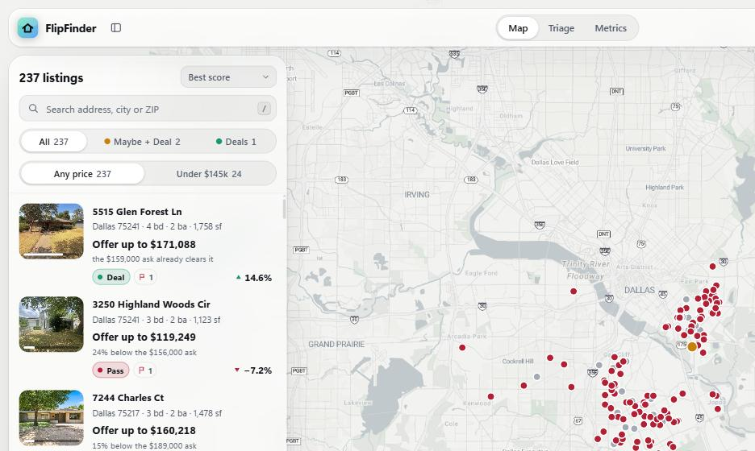
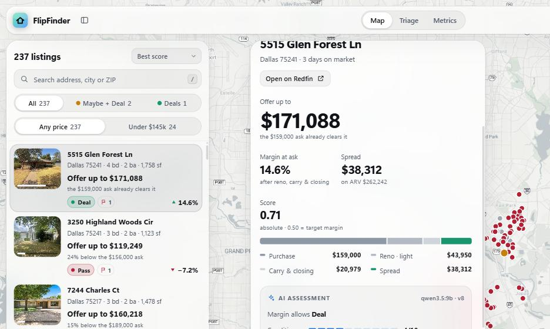

# FlipFinder

FlipFinder prices every active house in a Dallas buy box against what comparable houses
actually closed for, and tells you the most you could pay for it and still clear a 10%
margin.

The output is not a list of deals. Out of 237 listings in the buy box on the last run,
**one** cleared the target margin — and the honest summary of this project is that most of
the work went into measuring how wrong the price model is, rather than into finding houses.



Each listing leads with the offer, not the verdict. "Offer up to $171,088 — the $159,000 ask
already clears it" is actionable; "pass" twenty-six times is not.



## The numbers

Texas is a non-disclosure state, so Redfin's sold "price" is the last **asking** price. The
real close price is recovered from MLS ratio fields on each sold detail page, and everything
below is measured against that recovered close price on a held-out time split.

| population | n | AVM within ±20% | 95% CI |
| --- | --- | --- | --- |
| test sales listed at or below $145k | 161 | **64.6%** | [57.0, 71.6] |
| sold $145–250k | 790 | **74.4%** | [71.3, 77.3] |
| all test sales with a close price | 2,567 | **77.5%** | [75.9, 79.1] |
| asking price alone, listed ≤ $145k *(benchmark)* | 161 | **76.4%** | [69.3, 82.3] |

**The model does not beat the asking price in the low band.** 64.6% against 76.4% is a
11.8-point deficit, and the intervals barely overlap. Below $145k you would do better
predicting the close price with the number already printed on the listing. That result has
survived every change made to the model so far, and it is the reason the buy box now runs
to $250k, where the AVM is on much firmer ground.

Two caveats on reading the table. The 77.5% overall and the 96.3% that the asking price
scores overall are both flattered by selection: those populations are defined by the close
price, so scoring them with a number that tracks the close price is close to circular. Only
the `listed ≤ $145k` row is an honest benchmark, because that population is picked the way
the app picks — by asking price, before anything is known about the sale.

## How the backtest works, and why it is leakage-safe

The backtest replays 11,463 sales in time order and predicts each one as if standing on its
sale date.

- **Point-in-time comps.** Every feature for a target sale is built only from sales that
  closed *before* it. The comp query carries an `as_of` date; nothing later is visible.
- **A time split, not a random one.** The 8,024 oldest sales tune the model (the
  hyperparameter search, the distress/renovation keyword selection, and the renovated
  profile are all chosen here). The 3,439 newest sales are scored once, at the end. A random
  split would let the model learn from next year to predict last year.
- **A self-check that runs every time.** For every target the backtest inspects the comp
  rows it actually used and counts a violation if any comp closed on or after the target's
  sale date, if the target's own sale (by URL or by address) is in its own comp set, or if
  the tract $/sqft aggregate drew on a sale that had not closed yet. Last run: 11,463
  checked, 0 violations. The count prints on every run, so a regression cannot pass
  silently.
- **The population is chosen by asking price.** The headline metric is over sales *listed*
  at or below $145k, not sales that *closed* at or below $145k. Selecting by the sale price
  would be selecting on the answer.
- **Asking price is never a feature.** It is carried only as a benchmark column, which is
  how the 76.4% above is computed.

## Pipeline

```
browser ingestion    scripts/redfin_fetch.js, pasted into a real Chrome tab.
                     Redfin's WAF fingerprints non-browser TLS, so Python and curl
                     are blocked. Writes CSVs + JSON that run.py imports.
        |
close-price recovery MLS "RATIO Close Price" / "RATIO List Price" fields on each sold
                     detail page turn the last asking price into the real close price.
                     8,786 of 11,466 sales carry one.
        |
comps                Per listing: same tract, +/-25% sqft, detached only, weighted by
                     sqft / age / beds / distance / recency. Priced in close dollars.
        |
AVM                  LightGBM over comp, neighbourhood and remark features, fit on log
                     close price. Predicts the house as-is and as renovated; ARV is the
                     renovated prediction, floored at the as-is one.
        |
vision labeling      A local model (Ollama) reads up to 4 listing photos and returns a
                     condition score and a renovation scope, which sets the reno budget.
                     Nothing leaves the machine.
        |
scoring              margin, confidence, liquidity and distress combined as a weighted
                     geometric mean, so 0.50 means "at the target margin with average
                     everything". Max offer is derived from the same three terms as the
                     margin, so the headline and the margin cannot disagree.
```

## Setup

```
py -m pip install -r requirements.txt
```

**This repo ships no data.** No database, no listings, no photos, no agent remarks — `data/`
is gitignored and nothing scraped is committed. You have to fetch it yourself:

1. Open <https://www.redfin.com> in a real browser and sign in if you normally would.
2. Paste `scripts/redfin_fetch.js` into the DevTools console and let it run.
3. Move the downloaded `active*.csv`, `sold_zip_*.csv`, `enrich*.json` and
   `sold_detail_*.json` into `data/`.
4. Then:

```
py run.py refresh      # import, tract stats, score, vision-label, re-score
py run.py backtest     # measure the AVM and pick its config (about 10 minutes)
py run.py train        # refit on every sale using the config the backtest chose
py run.py serve        # http://127.0.0.1:8321
```

`py run.py --help` lists every command with a one-line description.

### Trying it without any of that

```
py run.py demo
py run.py serve
```

`demo` builds a fabricated dataset — invented addresses in an invented town, invented
prices, invented remarks, all seeded and all labelled as synthetic — and fits a model on it,
in about two seconds with no network access. It exists so the interface runs on a clean
checkout. It demonstrates the pipeline, not the model: the accuracy numbers above come from
the backtest over real sales, and nothing measured on invented data would mean anything.

## Known limits

- **Almost nothing pencils.** At a $145k cap, all 26 listings in the box had negative
  margins and the best needed 23.7% off the asking price. Raising the cap to $250k turned up
  exactly one listing above the target margin out of 237 — and that one flips to a pass if
  the renovation scope is "medium" rather than "light", a call the vision model makes from
  four photos.
- **High ARVs are not trustworthy.** Nine of the top fifteen predicted ARVs sit in a
  $1.37M–$1.51M band regardless of the inputs, which looks like the model saturating at the
  top of its training range rather than pricing those houses. Far outside the buy box, so it
  does not affect recommendations, but the top of the ARV distribution should be ignored.
- **The condition features barely matter.** Replacing an impossible "every renovation
  indicator on" profile with a realistic one moved the median ARV by 1.1%. The comp features
  dominate; the photo and remark signals are a rounding error next to them.
- **No human labels yet.** The scoring weights are the configured defaults. The fitter needs
  20 labels to run and has 0, so nothing in the score has been validated against a human
  judgement of whether a house is actually a good flip.
- **The AVM still loses to the asking price below $145k**, which is the band this was
  originally built for.

## Layout

```
flipfinder/analysis/   avm.py (the model), arv.py (comps + max offer), scorer.py,
                       backtest.py, photos.py (vision labeling), distress.py, fitter.py
flipfinder/ingest/     redfin.py, redfin_detail.py (close-price recovery), census.py
flipfinder/app/        FastAPI server + a single-file front end
scripts/               redfin_fetch.js, the browser-side pull
config.yaml            buy box, scoring weights, reno costs, markets
```

## License

MIT, see `LICENSE`.
